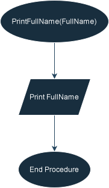

***
<h1 style = "border-bottom: none ; color : ";> Print Full Name Problem </h1>

***

## Function Specification
### 1.PrintFullName(const string& FullName)
* **Description** : This function **prints** the full name in the **console**.
* **Input** : **FullName**(String) - *Pass by Const Reference*.
* **Output** : **None** (Procedure only).<br>
**Note** : **Full Name** is passed by **Const Reference** to **avoid** unnecessary memory copying <br>
and **ensure** the original data remains unchanged

## Pseudocode

```text
Function PrintFullName(ConstByRef FullName)
  Print FullName
End Function
```

## Flowchart


## Usage
* **Run** [main.cpp](main.cpp) to see the **program's output** in the **console**
***